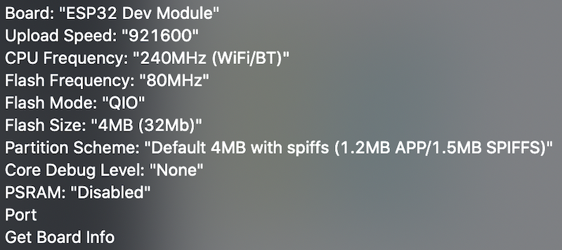
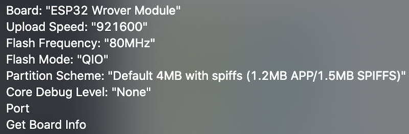

# esp32-incubator

DIY incubator system based on ESP32.

The article for how to make is [here](https://xor.hateblo.jp/entry/20200630/1593507600) (Japanese).

## Installation

1. Install board environment for **"esp32"** by Arduino IDE: Tools > Boards: XXXXX > Boards Manager...

2. Install some libraries (show below) from Arduino IDE: Tools > Manage Libraries...  
  - Ambient ESP32 ESP8266 Lib
  - DHT sensor library for ESPx
  - ESP32Servo
  - PubSubClient

3. Select compile & upload options for ESP32 like below.

  for ESP32 Dev Module:
  
  
  for ESP32 Wrover Module:
  
  
4. Create hardware and connect pins to sensors/actuators defined at the main sketch.

  | #define pin number | description |
  |:--|:--|
  | BUILTIN_LED | Indicator LED for heater On/Off |
  | DCfan_PIN | VCC pin of DC fan (need driver IC like MOSFET) |
  | DHTPIN | SDA pin of Temp/Humi sensor DHT22 (AM2302) |
  | Heater_PIN | Signal input pin of solid state relay with heater |
  | SERVO_PIN | PWM input pin of servo motor MG996R |

5. Rename `data/config_ro.sample.txt` to `data/config_ro.txt` and edit for your environment. It includes like wi-fi settings.

6. Rename `data/config_rw.sample.txt` to `data/config_rw.txt`. In most cases, this does not need to be edit.

7. Click [ Arduino IDE: Tools > ESP32 Sketch Data Upload ] to upload config files to ESP32's SPIFFS.

8. Upload sketch to ESP32 and run.

## Control via MQTT

[ wip ]

